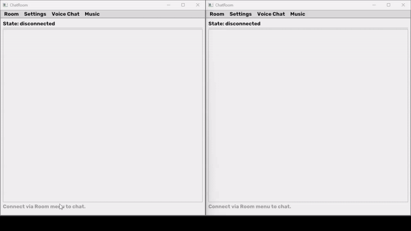

# Fox Chatroom



> Simple Walkthrough

## Features

-   Host or Join Mode: Any user can become the host
-   Room Key Access: Host shares a generated key with clients (its a encrypted key hold info ip and pass related data)
-   Real-time Text Chat (TCP based)
-   Real-time Voice Chat (FMOD + Opus, UDP based)
-   Offline Music Player (FMOD playback)
-   Multithreaded networking (send/receive loops)
-   Windows + MSVC v143 compatible

------------------------------------------------------------------------

## 🛠 Build Instructions (Windows / Visual Studio 2022)

From the project root:

``` bash
cmake -B build -S . -G "Visual Studio 17 2022"
cmake --build build --config Release
```

Executable will be located in:

    build/bin/Release/

------------------------------------------------------------------------
